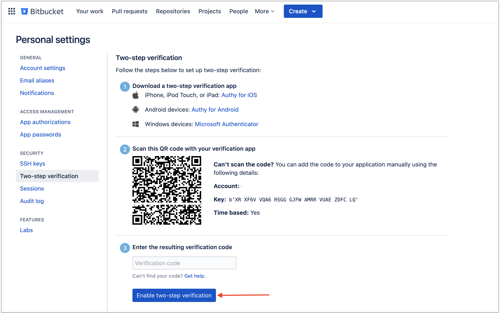
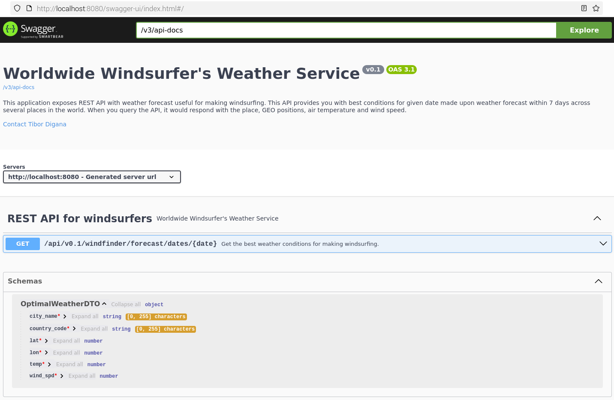
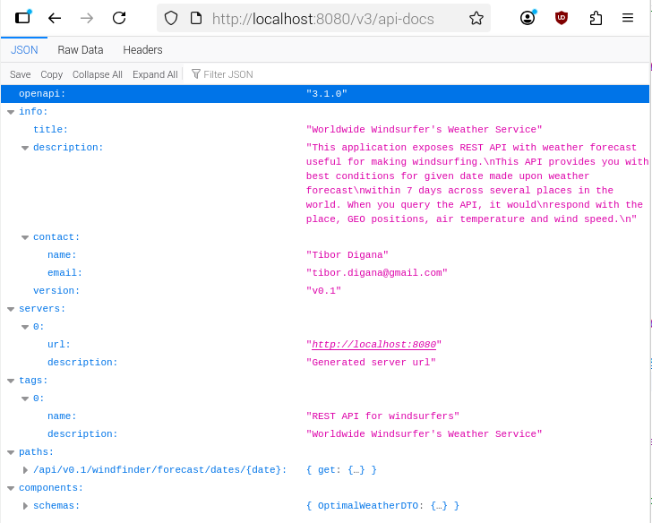
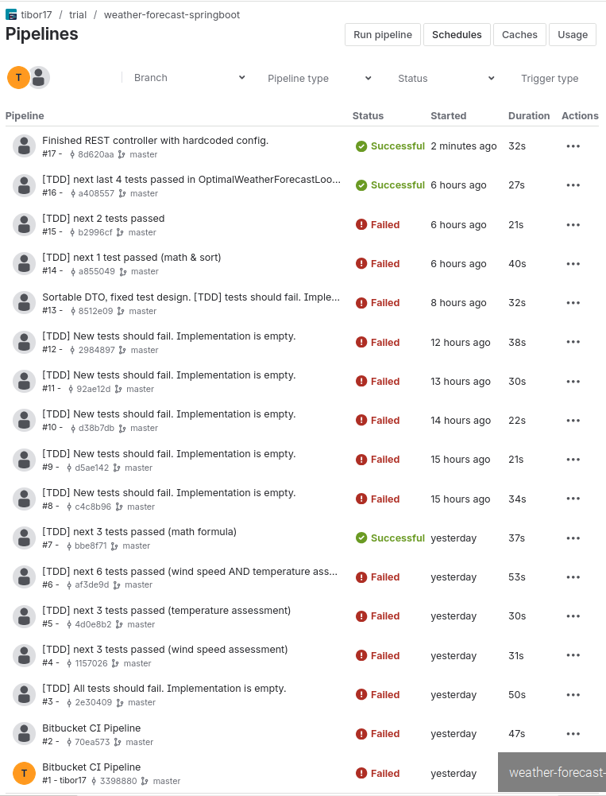

# README #

This README would normally document whatever steps are necessary to get your application up and running.

### What is this repository for? ###

* Quick summary
* Version v0.1

### Quick summary ###

The application estimates the best weather conditions for making the windsurfing
upon last 7 days of weather forecast (see *http://weatherbit.io*).
Register at Weatherbit, login and pickup the API Key from the settings.
The API Key appears in the form of the toke **7d5e9f0a410bc9bc3a21a6d01d5b0c51**.
I changed the API Key with **<32-bit ApiKey>** and environment variable **APIKEY** in the following sources:

1. *README.md*
2. *postgres-init.sql*
3. *WeatherForecastRestClientServiceTest.java*

### How do I set up remote access to Git in my private workspace of Bitbucket? ###

First, generate th SSH keys.
```console
$ ssh-keygen -t rsa
```

Copy the public SSH key into Bitbucket.
```console
$ cat .ssh/id_rsa.pub
```

Enter a new SSH public key in Workspace settings of your Bitbucket account.


### How do I set up CI pipeline in Bitbucket? ###

Navigate to the menu
[Two-step verification in your Bitbucket account](https://bitbucket.org/account/settings/two-step-verification/manage)
and then install [Authy](https://play.google.com/store/apps/details?id=com.authy.authy) on your mobile phone.

Associate Authy with your email and your phone number. Authy will send confirmation 6-digits code via SMS and then
to you e-mail. Retype the code in the mobile application.

Scan the QR code using Authy, and then Authy would periodically generate a new authorization code every 30 seconds.
Retype the code in the following screen and confirm the code. Your pipeline is ready to go.



Navigate to you project workspace, click on
[Pipeline](https://bitbucket.org/tibor17/weather-forecast-springboot/pipelines) in left menu and initiate the pipeline
by selecting the branch name.
Although the following commit failed, it is intentional in TDD because first we wrote a test but the code implementation
is empty and pretty does nothing. Step by step we would make every functionality ready together with the driver, and the
driver is the test code. The result is the application code (src/main/java) developed in time.


### How do I set up Docker on Linux? ###

```console
$ sudo apt update
$ sudo apt upgrade -y
$ curl -sSL https://get.docker.com | sh
$ sudo usermod -aG docker $USER
```

Then you should logout the user and reboot the system.
```console
$ logout
$ sudo reboot
```

After login back to the system, check the groups, and you should see "docker" in the list of groups.
```console
tibor17 adm dialout cdrom sudo audio video plugdev games users input render netdev lpadmin docker gpio i2c spi
```

Check the docker works properly and run this tiny application which prints a funny message *Hello from Docker!* in the console.
```console
$ docker run hello-world
```

### How do I build the project on Linux command line? ###

```console
$ mvn package
```

### How do I build the native image (system-dependent exec file) using GraalVM on Linux/Bash? ###

```console
$ ./build-native.sh
```
**Notice:** Take care! The script uses my paths, like **JAVA_HOME**, **GRAALVM_HOME**, **M2_HOME**.

### How do I run the application on Linux/Bash? ###

```console
$ ./run-java.sh
```
**Notice:** Take care! The script uses my paths, like **JAVA_HOME**.

### How do I run the Spring application using Maven? ###

```console
$ ./run-mvn-springboot.sh
```

OR

```console
$ mvn spring-boot:run -Dspring-boot.run.jvmArguments="-Dspring.profiles.active=dev -Dlogging.level.root=INFO -Dlogging.level.webfilter=WARN -Dlogging.level.app=WARN"
```

### WhHowo do I run the native application on Linux/Bash? ###

```console
$ run-native.sh
```

### How to test? ###

See the script...
```console
$ run-test.sh
```

### How do get Swagger (OpenAPI) response? ###

Example to use the service *http://localhost:8080/api/v0.1/windfinder/forecast/dates/2025-11-02*.
This HTTP call will obtain weather forecast corresponding to 2nd November 2025 across multiple
regions and then the best result is processed.

Open Swagger UI *http://localhost:8080/swagger-ui/index.html* in your browser.



OpenApi JSON:



### How do get Healthcheck response? ###

```console
$ curl -X GET http://localhost:8080/actuator/healthcheck
```

```json
{
  "status": "UP",
  "groups": [
    "liveness",
    "readiness"
  ],
  "components": {
    "diskSpace": {
      "status": "UP",
      "details": {
        "total": 251434516480,
        "free": 202564554752,
        "threshold": 10485760,
        "path": "/home/tibor17/projekty/weather-forecast-springboot/.",
        "exists": true
      }
    },
    "livenessState": {
      "status": "UP"
    },
    "ping": {
      "status": "UP"
    },
    "readinessState": {
      "status": "UP"
    },
    "ssl": {
      "status": "UP",
      "details": {
        "validChains": [

        ],
        "invalidChains": [

        ]
      }
    }
  }
}
```

### Configuration and data intervention ###

First, the SQL tables must be created.

```shell
CREATE TABLE settings
(
    id bigint NOT NULL CONSTRAINT settings_pk PRIMARY KEY,
    url varchar(255) NOT NULL,
    authkey varchar(32) NOT NULL
);

CREATE TABLE geo_location
(
    id bigint NOT NULL CONSTRAINT geo_location_pk PRIMARY KEY,
    latitude numeric(7, 5) NOT NULL,
    longitude numeric(8, 5) NOT NULL,
    country varchar(255) NOT NULL,
    city varchar(255) NOT NULL
);

CREATE SEQUENCE id_seq START 101 CACHE 10;
```

Start Docker containers of PostgreSQL database and PgAdmin.

```console
$ docker compose up -d

# stop the database and PgAdmin containers as follows:
$ docker compose down
```

```console
$ docker compose logs pgadmin
...
pgadmin  | ::ffff:172.18.0.1 - - [03/Nov/2025:04:54:25 +0000] "GET /browser/ HTTP/1.1" 200 2933 "http://localhost:5050/login?next=/browser/" "Mozilla/5.0 (X11; Linux x86_64; rv:142.0) Gecko/20100101 Firefox/142.0"
...
# and check the logs of the dabase itself
$ docker compose logs postgres
```

Now PgAdmin is running (open the address *http://localhost:5050/browser/* in the browser), create a new database.
In my case the name of database server is *postgresdb* and the connection IP address is the address
behind the bridge *172.18.0.1*.


```console
$ telnet localhost 5432
Trying ::1...
Connected to localhost.
Escape character is '^]'.
```

The data should be inserted and modified whenever the application is running.

```shell
INSERT INTO settings (id, url, authkey) VALUES (nextval('id_seq'), 'http://api.weatherbit.io', '<32-bit ApiKey>');
INSERT INTO geo_location (id, latitude, longitude, country, city) VALUES (nextval('id_seq'), 54.69606, 18.67873, 'PL', 'Jastarnia');
INSERT INTO geo_location (id, latitude, longitude, country, city) VALUES (nextval('id_seq'), 13.10732, -59.62021, 'Barbados', 'Bridgetown');
INSERT INTO geo_location (id, latitude, longitude, country, city) VALUES (nextval('id_seq'), -3.71722, -38.54306, 'Brazil', 'Fortaleza');
INSERT INTO geo_location (id, latitude, longitude, country, city) VALUES (nextval('id_seq'), 34.66942, 32.70132, 'Cyprus', 'Pissouri');
INSERT INTO geo_location (id, latitude, longitude, country, city) VALUES (nextval('id_seq'), 44.92736, 7.71703, 'Mauritius', 'La Morne');
COMMIT;
```

In order to find out the Geo positions according to the names of countries and cities, you can use the following HTTP call
in your browser. This is the example with country *Mauritius* and city *Le Morne*:
*https://api.weatherbit.io/v2.0/forecast/daily?country=Le%20Morne&city=Mauritius&days=8&key=<32-bit ApiKey>*

Similar example is here with Poland and city Jastarnia
*https://api.weatherbit.io/v2.0/forecast/daily?country=PL&city=Jastarnia&days=8&key=<32-bit ApiKey>*.

Finally, the application will call the following list of URL addresses:

1. *https://api.weatherbit.io/v2.0/forecast/daily?lat=54.69606&lon=18.67873&key=<32-bit ApiKey>*
2. *https://api.weatherbit.io/v2.0/forecast/daily?lat=13.10732&lon=-59.62021&key=<32-bit ApiKey>*
3. *https://api.weatherbit.io/v2.0/forecast/daily?lat=-3.71722&lon=-38.54306&key=<32-bit ApiKey>*
4. *https://api.weatherbit.io/v2.0/forecast/daily?lat=34.66942&lon=32.70132&key=<32-bit ApiKey>
5. *https://api.weatherbit.io/v2.0/forecast/daily?lat=44.92736&lon=7.71703&key=<32-bit ApiKey>

Finally, you can test the REST service in your browser, example:

*http://localhost:8080/api/v0.1/windfinder/forecast/dates/2025-11-03*

OR

in the command line using cURL:

```console
$ curl -X GET http://localhost:8080/api/v0.1/windfinder/forecast/dates/2025-11-03
```


### Development process - SDLC ###

We use Test Driven Development (TDD), so that first we write the tests but the implementation is empty.
You can see multiple commits. Although their tests still fail, the number of failures is getting still lower
until the CI Pipeline reports successful build. Then we continue with another set of tests and functionality.

Pipeline URL: *https://bitbucket.org/tibor17/weather-forecast-springboot/pipelines*



